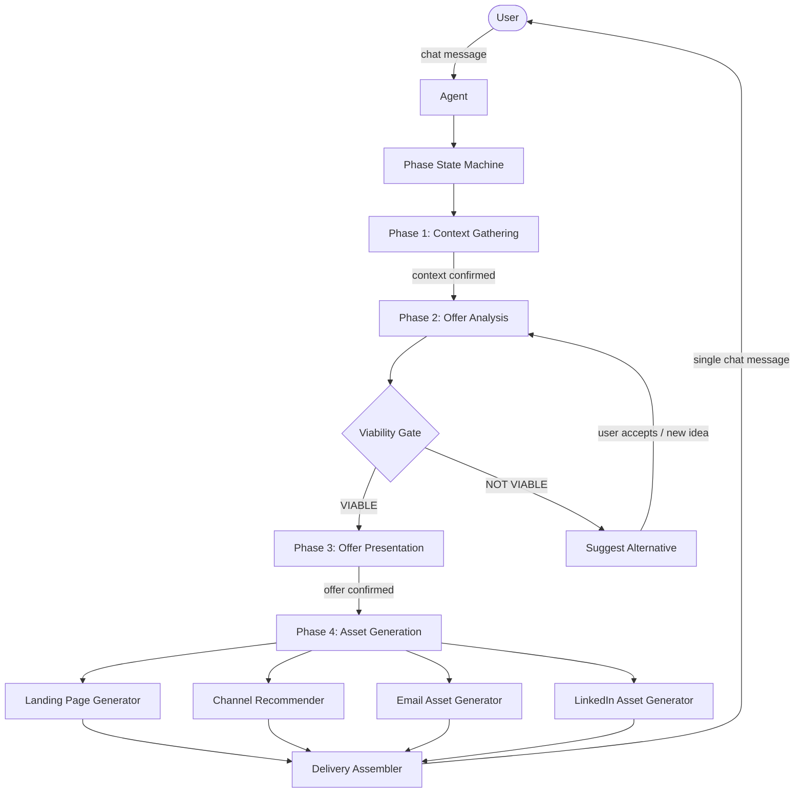

# Design Document: product-launch-package

## Overview

LaunchSense is a chat-first agentic application that guides a business owner through a fixed four-phase conversation and produces a complete launch package — all inside the chat window. There is no separate UI, no forms, and no dashboard. The Agent is the application.

The system is built around a phase-based state machine. Each phase has a clear entry condition, a set of actions, and an exit condition. The Agent enforces phase ordering in code; no phase can begin until the previous one is confirmed by the user.

The four phases are:

1. Business Idea and Context — gather context
2. Offer Analysis and Consolidation — analyse viability, produce Offer
3. Offer Presentation — confirm Offer with user
4. Landing Page and Marketing Strategy — generate and deliver all assets

---

## Architecture

The system is a single-agent architecture with a deterministic phase state machine at its core. The Agent holds conversation state, drives phase transitions, and calls discrete generation modules for each content type.



### Key Architectural Decisions

- The phase state machine is the single source of truth for conversation progress. All phase transitions are explicit and logged.
- The Viability Gate is a discrete, independently testable function — not embedded in general Agent reasoning.
- Each generation step (landing page, email, LinkedIn) is independently callable so that a failure in one does not block delivery of the others (Requirement 4.10).
- All output is delivered in chat. No external files, no dashboards.

---

## Components and Interfaces

### 1. Phase State Machine

Manages the current phase and enforces ordering.

```
PhaseStateMachine
  state: Phase  // PHASE_1 | PHASE_2 | PHASE_3 | PHASE_4 | COMPLETE
  transition(event: PhaseEvent) → Phase | Error
  canTransition(from: Phase, to: Phase) → boolean
```

Valid transitions:
- `PHASE_1 → PHASE_2` — triggered when user confirms Business_Context summary
- `PHASE_2 → PHASE_3` — triggered when Viability Gate returns VIABLE and Offer is consolidated
- `PHASE_2 → PHASE_2` — triggered when user accepts alternative or provides new idea (loop)
- `PHASE_3 → PHASE_4` — triggered when user confirms Offer
- `PHASE_4 → COMPLETE` — triggered when all assets are delivered

### 2. Context Collector (Phase 1)

Extracts and tracks the three required context elements from free-text conversation.

```
ContextCollector
  extract(messages: Message[]) → PartialBusinessContext
  getMissingElements(ctx: PartialBusinessContext) → ContextElement[]
  buildSummary(ctx: BusinessContext) → string
```

### 3. Viability Gate (Phase 2)

Analyses the idea against four dimensions and returns a classification.

```
ViabilityGate
  analyse(ctx: BusinessContext) → ViabilityAnalysis
  classify(analysis: ViabilityAnalysis) → "VIABLE" | "NOT_VIABLE"
  suggestAlternative(ctx: BusinessContext, analysis: ViabilityAnalysis) → string
```

Dimensions analysed: target customer clarity, pain point severity, market differentiation, monetisation plausibility.

### 4. Offer Consolidator (Phase 2)

Builds the structured Offer from a viable analysis.

```
OfferConsolidator
  consolidate(ctx: BusinessContext, analysis: ViabilityAnalysis) → Offer
```

### 5. Offer Presenter (Phase 3)

Formats the Offer for chat display and handles adjustment requests.

```
OfferPresenter
  format(offer: Offer) → string
  applyAdjustments(offer: Offer, adjustments: string) → Offer
```

### 6. Asset Generators (Phase 4)

Each generator is independently callable and returns a Result type (success or failure with reason).

```
LandingPageGenerator
  generate(offer: Offer) → Result<LandingPageCopy>

ChannelRecommender
  recommend(offer: Offer) → Result<ChannelRecommendation>

EmailAssetGenerator
  generate(offer: Offer, channel: ChannelRecommendation) → Result<EmailAsset>

LinkedInAssetGenerator
  generate(offer: Offer, channel: ChannelRecommendation) → Result<LinkedInAsset>
```

### 7. Delivery Assembler (Phase 4)

Collects results from all generators and assembles the final chat message. Handles partial failures per Requirement 4.10.

```
DeliveryAssembler
  assemble(
    landingPage: Result<LandingPageCopy>,
    channel: Result<ChannelRecommendation>,
    email: Result<EmailAsset>,
    linkedin: Result<LinkedInAsset>
  ) → string
```

---

## Data Models

### BusinessContext

```typescript
interface BusinessContext {
  businessType: string        // existing business type
  customerBase: string        // current customer base description
  productIdea: string         // new product/service idea
}

type PartialBusinessContext = Partial<BusinessContext>

type ContextElement = "businessType" | "customerBase" | "productIdea"
```

### ViabilityAnalysis

```typescript
interface ViabilityDimension {
  name: "targetCustomerClarity" | "painPointSeverity" | "marketDifferentiation" | "monetisationPlausibility"
  assessment: string
}

interface ViabilityAnalysis {
  dimensions: ViabilityDimension[]   // exactly 4 entries
  summary: string                    // ≤150 words
  classification: "VIABLE" | "NOT_VIABLE"
  alternativeSuggestion?: string     // present when NOT_VIABLE
}
```

### Offer

```typescript
interface Offer {
  targetSegment: string       // target customer segment
  painPoint: string           // core pain point
  outcomeStatement: string    // outcome the customer achieves
  guarantee: string           // guarantee offered
  finalOfferStatement: string // complete offer statement
}
```

### LandingPageCopy

```typescript
interface LandingPageCopy {
  headline: string            // ≤12 words
  subheadline: string         // ≤25 words
  problemStatement: string    // ≤100 words
  solutionExplanation: string // ≤150 words
  cta: string                 // ≤8 words, single imperative phrase
}
```

### ChannelRecommendation

```typescript
type Channel = "LinkedIn" | "email"

interface ChannelRecommendation {
  primaryChannel: Channel
  rationale: string           // ≤50 words
}
```

### MarketingAssets

```typescript
interface EmailAsset {
  body: string                // ≤200 words
  referencesOfferStatement: boolean
}

interface LinkedInAsset {
  body: string                // ≤300 characters
  referencesOfferStatement: boolean
}
```

### Result Type

```typescript
type Result<T> =
  | { success: true; value: T }
  | { success: false; error: string }
```

### ConversationState

```typescript
interface ConversationState {
  phase: "PHASE_1" | "PHASE_2" | "PHASE_3" | "PHASE_4" | "COMPLETE"
  businessContext?: BusinessContext
  viabilityAnalysis?: ViabilityAnalysis
  offer?: Offer
  launchPackage?: LaunchPackage
  phase2IterationCount: number
}

interface LaunchPackage {
  landingPageCopy: LandingPageCopy
  channelRecommendation: ChannelRecommendation
  emailAsset: EmailAsset
  linkedInAsset: LinkedInAsset
}
```


---

## Correctness Properties

*A property is a characteristic or behavior that should hold true across all valid executions of a system — essentially, a formal statement about what the system should do. Properties serve as the bridge between human-readable specifications and machine-verifiable correctness guarantees.*

### Property 1: Context summary completeness

*For any* valid `BusinessContext` (with all three fields populated), the summary string produced by `ContextCollector.buildSummary()` must contain the business type, customer base description, and product idea.

**Validates: Requirements 1.4**

---

### Property 2: Follow-up targets only missing elements

*For any* `PartialBusinessContext` with one or more missing fields, the follow-up question generated by the Agent must reference only the missing context elements and not re-ask for elements already provided.

**Validates: Requirements 1.3**

---

### Property 3: Phase gate invariant

*For any* `ConversationState`, the phase can only advance to phase N+1 if the user has explicitly confirmed the output of phase N. Specifically: `PHASE_2` is only reachable after Business_Context confirmation; `PHASE_3` is only reachable after a VIABLE classification; `PHASE_4` is only reachable after Offer confirmation.

**Validates: Requirements 1.5, 2.7, 3.4**

---

### Property 4: Analysis covers all four dimensions

*For any* `BusinessContext`, the `ViabilityAnalysis` returned by `ViabilityGate.analyse()` must contain exactly four dimension entries: `targetCustomerClarity`, `painPointSeverity`, `marketDifferentiation`, and `monetisationPlausibility`.

**Validates: Requirements 2.1**

---

### Property 5: Analysis summary word count

*For any* `ViabilityAnalysis`, the `summary` field must contain no more than 150 words.

**Validates: Requirements 2.2**

---

### Property 6: Viability Gate totality

*For any* `ViabilityAnalysis`, `ViabilityGate.classify()` must return exactly `"VIABLE"` or `"NOT_VIABLE"` — no other value and no error for valid input.

**Validates: Requirements 2.3**

---

### Property 7: VIABLE path produces a complete Offer

*For any* `BusinessContext` and `ViabilityAnalysis` where `classification === "VIABLE"`, the `Offer` produced by `OfferConsolidator.consolidate()` must have all five fields non-empty: `targetSegment`, `painPoint`, `outcomeStatement`, `guarantee`, and `finalOfferStatement`.

**Validates: Requirements 2.4**

---

### Property 8: NOT_VIABLE path produces an alternative suggestion

*For any* `ViabilityAnalysis` where `classification === "NOT_VIABLE"`, the analysis must include a non-empty `alternativeSuggestion` field.

**Validates: Requirements 2.5**

---

### Property 9: Offer format contains all five fields

*For any* `Offer`, the string produced by `OfferPresenter.format()` must contain all five offer fields: target segment, pain point, outcome statement, guarantee, and final offer statement.

**Validates: Requirements 3.1**

---

### Property 10: Landing page copy satisfies all word limits

*For any* `Offer`, the `LandingPageCopy` produced by `LandingPageGenerator.generate()` must satisfy: headline ≤ 12 words, subheadline ≤ 25 words, problem statement ≤ 100 words, solution explanation ≤ 150 words, CTA ≤ 8 words.

**Validates: Requirements 4.1**

---

### Property 11: Channel recommendation validity and rationale length

*For any* `Offer`, the `ChannelRecommendation` produced by `ChannelRecommender.recommend()` must have `primaryChannel` equal to `"LinkedIn"` or `"email"`, and the `rationale` must be no more than 50 words.

**Validates: Requirements 4.2, 4.3**

---

### Property 12: Email asset constraints

*For any* `EmailAsset`, the `body` must be no more than 200 words, and `referencesOfferStatement` must be `true`.

**Validates: Requirements 4.4, 4.6**

---

### Property 13: LinkedIn asset constraints

*For any* `LinkedInAsset`, the `body` must be no more than 300 characters, and `referencesOfferStatement` must be `true`.

**Validates: Requirements 4.5, 4.6**

---

### Property 14: Delivery order and section labelling

*For any* complete `LaunchPackage`, the string produced by `DeliveryAssembler.assemble()` must contain all four sections in order — Landing Page Copy, Channel Recommendation, Email Asset, LinkedIn Asset — and each section must begin with a clearly labelled heading.

**Validates: Requirements 4.7, 4.8**

---

### Property 15: Partial failure delivery

*For any* combination of `Result<T>` values passed to `DeliveryAssembler.assemble()`, all successful sections must appear in the output, and any failed section must be represented by a clearly labelled failure notice (not silently omitted).

**Validates: Requirements 4.10**

---

## Error Handling

### Phase Transition Errors

- If the state machine receives a transition event that is not valid for the current phase, it must reject the transition and return an error. The conversation state must not change.
- If the Agent attempts to call a Phase N+1 component while still in Phase N, this is a programming error and must throw immediately (fail fast).

### Viability Gate — NOT_VIABLE Loop

- The Agent must handle repeated NOT_VIABLE cycles gracefully. There is no hard limit specified in requirements, but the Agent should track `phase2IterationCount` to allow future policy decisions (e.g., offering to exit after N loops).

### Asset Generation Failures

- Each generator returns a `Result<T>`. A failure result must include a human-readable `error` string.
- `DeliveryAssembler` must never throw due to a generator failure. It assembles what it can and labels failures inline.
- If all four generators fail, the assembled message must still be posted, containing four failure notices.

### Context Extraction Failures

- If the Agent cannot extract any context elements from a message, it must ask a broad opening question rather than silently proceeding with empty context.

### Word / Character Limit Violations

- If a generator produces output that exceeds the specified limit, the generator must truncate or retry before returning. It must not return a `Result` with `success: true` if the output violates constraints.

---

## Testing Strategy

### Dual Testing Approach

Both unit tests and property-based tests are required. They are complementary:

- **Unit tests** cover specific examples, integration points, and edge cases.
- **Property-based tests** verify universal properties across many generated inputs.

### Property-Based Testing

Use a property-based testing library appropriate for the target language (e.g., `fast-check` for TypeScript/JavaScript, `hypothesis` for Python, `QuickCheck` for Haskell).

Each property test must:
- Run a minimum of **100 iterations**
- Be tagged with a comment in the format: `Feature: product-launch-package, Property {N}: {property_text}`
- Map 1:1 to a Correctness Property in this document

Property test targets:

| Property | Test Description |
|---|---|
| P1 | Generate random BusinessContext; assert summary contains all three fields |
| P2 | Generate random PartialBusinessContext; assert follow-up only mentions missing fields |
| P3 | Generate random conversation event sequences; assert no invalid phase transitions succeed |
| P4 | Generate random BusinessContext; assert ViabilityAnalysis has exactly 4 dimensions |
| P5 | Generate random ViabilityAnalysis; assert summary word count ≤ 150 |
| P6 | Generate random ViabilityAnalysis; assert classify() returns only VIABLE or NOT_VIABLE |
| P7 | Generate random VIABLE analysis; assert Offer has all 5 fields non-empty |
| P8 | Generate random NOT_VIABLE analysis; assert alternativeSuggestion is non-empty |
| P9 | Generate random Offer; assert formatted string contains all 5 fields |
| P10 | Generate random Offer; assert all LandingPageCopy word limits are satisfied |
| P11 | Generate random Offer; assert channel is LinkedIn or email and rationale ≤ 50 words |
| P12 | Generate random EmailAsset; assert body ≤ 200 words and referencesOfferStatement is true |
| P13 | Generate random LinkedInAsset; assert body ≤ 300 characters and referencesOfferStatement is true |
| P14 | Generate random LaunchPackage; assert assembled output has all 4 sections in order with headings |
| P15 | Generate random Result combinations; assert successful sections present and failures labelled |

### Unit Tests

Focus on:

- **Phase 1**: First message triggers prompt for all three context elements (example test for Requirement 1.1)
- **Phase 3**: Offer adjustment updates the correct fields and re-presents (example test for Requirement 3.3)
- **Phase 4**: Refinement invitation is present after full delivery (example test for Requirement 4.9)
- **Error conditions**: Invalid phase transitions are rejected; all-failure delivery still posts a message
- **Edge cases**: Empty strings in context fields, zero-word summaries, all generators failing simultaneously

### Test Configuration

```
// Example tag format
// Feature: product-launch-package, Property 10: Landing page copy satisfies all word limits
test.prop([arbitraryOffer])("landing page copy word limits", (offer) => {
  const result = landingPageGenerator.generate(offer);
  // assertions...
});
```
