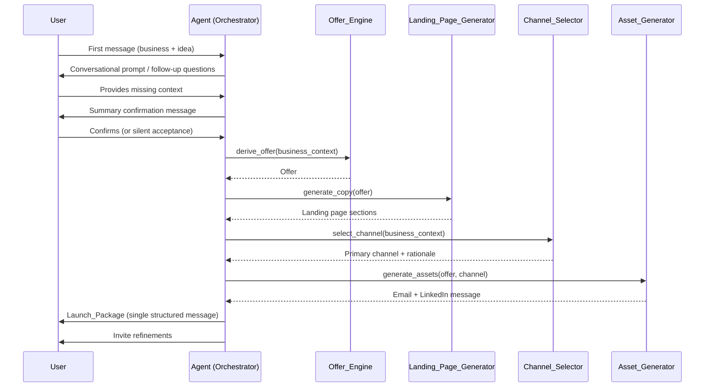

# Design Document: LaunchSense — Product Launch Package

## Overview

LaunchSense is a chat-native agentic application. The entire user experience is a single conversation: the user describes their business and idea, and the AI agent returns a complete, commercially structured Launch Package — offer, landing page copy, and outreach assets — without any forms, dashboards, or separate UI.

The system is built around a single orchestrating agent that manages a linear pipeline of generation steps. Each step is a discrete capability (Offer_Engine, Landing_Page_Generator, Channel_Selector, Asset_Generator). The agent drives the conversation, gathers context, confirms understanding, runs the pipeline, and delivers the final package — all within the chat thread.

The design prioritises simplicity: one conversation, one pipeline, one output. There is no persistent user state beyond the current session, no authentication, and no database. The chat history is the only state.

---

## Architecture

The system follows a single-agent orchestration pattern. The agent is the sole entry point; all capabilities are invoked by the agent as internal tool calls or structured prompts. The chat interface is the only UI layer.



### Key Architectural Decisions

- **No persistent storage**: Session state lives entirely in the in-memory conversation context. This keeps the hackathon scope tight and eliminates auth/DB complexity.
- **Linear pipeline**: Steps run sequentially (Offer → Copy → Channel → Assets). Each step depends on the output of the previous. No parallelism is needed given the dependency chain.
- **Agent as orchestrator**: The LLM agent both drives the conversation and invokes the generation capabilities. Capabilities are implemented as structured sub-prompts or tool calls within the same model context.
- **Chat is the UI**: Output is Markdown-formatted text posted into the chat. No rendering layer is needed.

---

## Components and Interfaces

### Agent (Orchestrator)

Responsible for: managing conversation state, detecting when Business_Context is complete, confirming context with the user, sequencing the pipeline, and assembling the final Launch_Package message.

```
interface Agent {
  handleMessage(userMessage: string, history: ConversationTurn[]): AgentResponse
}

interface AgentResponse {
  message: string          // text posted to chat
  state: ConversationState // updated state after this turn
}
```

### Offer_Engine

Derives the structured offer from confirmed Business_Context.

```
interface OfferEngine {
  deriveOffer(context: BusinessContext): Offer | OfferError
}
```

### Landing_Page_Generator

Produces the five copy sections from a confirmed Offer.

```
interface LandingPageGenerator {
  generateCopy(offer: Offer): LandingPageCopy | CopyError
}
```

### Channel_Selector

Evaluates three candidate channels and selects one.

```
interface ChannelSelector {
  selectChannel(context: BusinessContext): ChannelSelection
}
```

### Asset_Generator

Produces the email and LinkedIn message from the offer and selected channel.

```
interface AssetGenerator {
  generateAssets(offer: Offer, channel: ChannelSelection): LaunchAssets | AssetError
}
```

---

## Data Models

### BusinessContext

```typescript
interface BusinessContext {
  businessType: string       // e.g. "B2B SaaS", "local bakery"
  customerBase: string       // description of existing customers
  newIdea: string            // description of the new product/service idea
  confirmed: boolean         // true after user confirms the summary
}
```

### Offer

```typescript
interface Offer {
  targetSegment: string      // derived customer segment
  painPoint: string          // core pain point
  outcomeStatement: string   // clear outcome the offer delivers
  riskReduction: string      // guarantee or risk-reduction element
  finalOfferStatement: string // single coherent sentence/paragraph combining all elements
}
```

### LandingPageCopy

```typescript
interface LandingPageCopy {
  headline: string           // ≤ 12 words
  subheadline: string        // ≤ 25 words
  problemStatement: string   // ≤ 100 words
  solutionExplanation: string // ≤ 150 words
  cta: string                // ≤ 8 words, imperative phrase
}
```

### ChannelSelection

```typescript
type Channel = "cold_outreach" | "existing_customer_email" | "organic_social"

interface ChannelSelection {
  primary: Channel
  rationale: string          // ≤ 50 words
  isDefault: boolean         // true if defaulted due to insufficient context
}
```

### LaunchAssets

```typescript
interface LaunchAssets {
  email: string              // ≤ 200 words
  linkedInMessage: string    // ≤ 300 characters
}
```

### LaunchPackage

```typescript
interface LaunchPackage {
  offer: Offer
  landingPageCopy: LandingPageCopy
  channelSelection: ChannelSelection
  assets: LaunchAssets
}
```

### ConversationState

```typescript
type ConversationPhase =
  | "gathering_context"
  | "confirming_context"
  | "generating"
  | "delivered"
  | "refining"

interface ConversationState {
  phase: ConversationPhase
  context: Partial<BusinessContext>
  offer?: Offer
  landingPageCopy?: LandingPageCopy
  channelSelection?: ChannelSelection
  assets?: LaunchAssets
}
```

### ConversationTurn

```typescript
interface ConversationTurn {
  role: "user" | "agent"
  content: string
}
```

---


## Correctness Properties

*A property is a characteristic or behavior that should hold true across all valid executions of a system — essentially, a formal statement about what the system should do. Properties serve as the bridge between human-readable specifications and machine-verifiable correctness guarantees.*

### Property 1: Follow-up targets only missing context fields

*For any* partial BusinessContext (any combination of the three required fields being absent), the agent's follow-up response should ask about exactly the missing fields and not re-ask for fields already provided.

**Validates: Requirements 1.4**

---

### Property 2: Generation does not begin before context is confirmed

*For any* conversation history, no Offer, LandingPageCopy, ChannelSelection, or LaunchAssets content should appear in the agent's output before a context confirmation turn has occurred (i.e., the ConversationState phase must pass through `confirming_context` before `generating`).

**Validates: Requirements 1.3, 1.5**

---

### Property 3: Offer completeness

*For any* valid confirmed BusinessContext, the Offer returned by Offer_Engine should have all five fields non-empty: `targetSegment`, `painPoint`, `outcomeStatement`, `riskReduction`, and `finalOfferStatement`.

**Validates: Requirements 2.1, 2.2, 2.3, 2.4, 2.5**

---

### Property 4: Landing page copy length constraints

*For any* valid Offer, the LandingPageCopy produced by Landing_Page_Generator should satisfy all of the following simultaneously: headline ≤ 12 words, subheadline ≤ 25 words, problemStatement ≤ 100 words, solutionExplanation ≤ 150 words, cta ≤ 8 words.

**Validates: Requirements 3.1, 3.2, 3.3, 3.4, 3.5**

---

### Property 5: Channel selection validity and rationale length

*For any* valid BusinessContext, the ChannelSelection returned by Channel_Selector should have `primary` be one of the three valid enum values (`cold_outreach`, `existing_customer_email`, `organic_social`), and `rationale` should be no more than 50 words.

**Validates: Requirements 4.1, 4.2**

---

### Property 6: Asset length constraints

*For any* valid Offer and ChannelSelection, the LaunchAssets produced by Asset_Generator should satisfy: email ≤ 200 words and linkedInMessage ≤ 300 characters.

**Validates: Requirements 5.1, 5.2**

---

### Property 7: Assets reference the final offer statement

*For any* valid Offer and ChannelSelection, both the email and the LinkedIn message produced by Asset_Generator should contain content derived from the `finalOfferStatement` — specifically, key distinguishing terms from the offer statement should appear in each asset.

**Validates: Requirements 5.3**

---

### Property 8: Launch Package section ordering and labelling

*For any* complete LaunchPackage, the rendered chat message should contain all three section headings (Offer, Landing Page, Launch Assets) and they should appear in that order (Offer before Landing Page, Landing Page before Launch Assets).

**Validates: Requirements 6.1, 6.2**

---

## Error Handling

Each generation step can fail independently. The agent handles failures gracefully without aborting the entire pipeline.

### Context Gathering Errors

- If the user's message is ambiguous or too short to extract any context element, the agent asks a targeted clarifying question (Requirement 1.4).
- The agent will not loop indefinitely: after two consecutive failed attempts to gather a missing element, it posts a brief explanation and invites the user to restart.

### Offer_Engine Failure (Requirement 2.6)

- If `deriveOffer` returns an `OfferError`, the agent posts a message explaining which aspect of the idea could not be resolved and asks the user to clarify.
- Generation pipeline halts; no downstream steps run.

### Landing_Page_Generator Failure (Requirement 3.6)

- If `generateCopy` returns a `CopyError`, the agent posts the Offer section and identifies the missing copy section by name.
- The agent continues to Channel_Selector and Asset_Generator with the partial package.

### Channel_Selector Default (Requirement 4.3)

- If context is insufficient to differentiate channels, `isDefault` is set to `true` and `primary` is set to `existing_customer_email`.
- The rationale explicitly states this is a default assumption.

### Asset_Generator Failure (Requirement 5.4)

- If `generateAssets` returns an `AssetError`, the agent posts all successfully generated sections and names the missing asset.

### Partial Package Delivery (Requirement 6.4)

- The agent always posts whatever was successfully generated.
- Failed sections are replaced with a clearly labelled placeholder: `[Section could not be generated: <reason>]`.

---

## Testing Strategy

### Dual Testing Approach

Both unit tests and property-based tests are required. They are complementary:

- **Unit tests** cover specific examples, integration points, and error conditions.
- **Property tests** verify universal constraints across randomly generated inputs.

### Property-Based Testing

**Library**: [fast-check](https://github.com/dubzzz/fast-check) (TypeScript/JavaScript). Each property test runs a minimum of **100 iterations**.

Each test is tagged with a comment in the format:
`// Feature: product-launch-package, Property <N>: <property_text>`

Each correctness property maps to exactly one property-based test:

| Property | Test description |
|---|---|
| Property 1 | Arbitrary partial BusinessContext → follow-up asks only for missing fields |
| Property 2 | Arbitrary conversation histories → no generation output before confirmation phase |
| Property 3 | Arbitrary confirmed BusinessContext → all Offer fields non-empty |
| Property 4 | Arbitrary Offer → all LandingPageCopy fields within word/char limits |
| Property 5 | Arbitrary BusinessContext → ChannelSelection.primary in valid enum, rationale ≤ 50 words |
| Property 6 | Arbitrary Offer + ChannelSelection → email ≤ 200 words, linkedInMessage ≤ 300 chars |
| Property 7 | Arbitrary Offer + ChannelSelection → both assets contain terms from finalOfferStatement |
| Property 8 | Arbitrary LaunchPackage → rendered message has correct section order and headings |

### Unit Tests

Unit tests focus on:

- **Example-based**: First message triggers a prompt covering all three context elements (Requirement 1.1); post-delivery message contains refinement invitation (Requirement 6.3).
- **Error conditions**: OfferError → agent posts clarification request; CopyError → agent names missing section; AssetError → agent names missing asset; partial package delivery with failed section placeholder.
- **Edge cases**: Channel_Selector defaults to `existing_customer_email` when context is ambiguous; empty/whitespace business context is handled gracefully.
- **Integration**: Full pipeline from confirmed BusinessContext to rendered LaunchPackage message.

### Test Configuration

```typescript
// fast-check configuration for all property tests
fc.configureGlobal({ numRuns: 100 });
```
